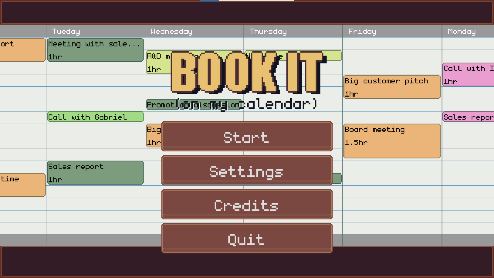
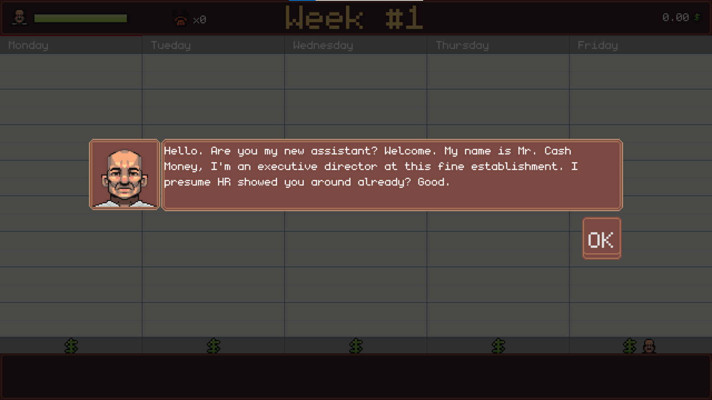
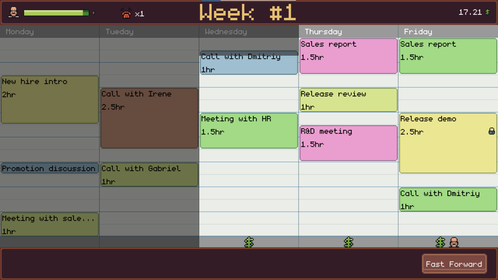
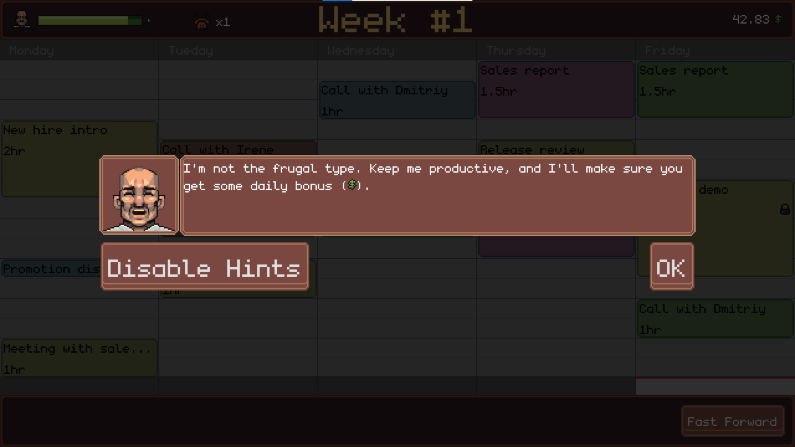

# BOOK IT #

A Weekly Game Jam #257 entry, made with [Godot engine](https://godotengine.org/) in roughly three days. The theme is "Books", so this game is about booking time slots on a calendar.

# Screenshots #

    
    
    
    

# Credits #

## Font ##
- [monogram](https://datagoblin.itch.io/monogram) by datagoblin

## Music ##
- [Two Left Socks](https://opengameart.org/content/two-left-socks) by congusbongus
- [Shopping Theme](https://opengameart.org/content/shopping-theme) by ["Paranoid"](https://soundcloud.com/prtrblnd)
- [Somewhere in the Elevator](https://opengameart.org/content/somewhere-in-the-elevator) by Peachtea@You're Perfect Studio

## Art ##
- Slightly modified [Masculine_A](https://aivopiru.itch.io/pixelart-portrait-bases) portrait by Aivopiru.
- The rest is made for this jam by me.

## Code ##
- [Dmitriy Shmilo](https://dmitriy-shmilo.itch.io/)
